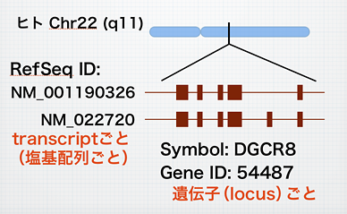
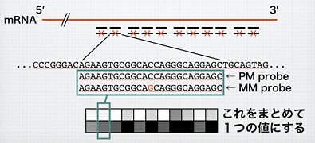

<h1 id="content_1_0"> 「RefSeqの検索とRefEx (Reference Expression dataset)」  </h1>

<ul class="list1" style="padding-left:16px;margin-left:16px"><li>遺伝子を「さがす」ためのデータベース活用法の基礎を解説し、当センターで開発中の遺伝子検索サイト「GGRNA」および遺伝子発現量のリファレンスデータベース「RefEx」を紹介します。</li></ul>

<h3 id="content_1_1"> 遺伝子をさがす（基礎）  </h3>
<ul class="list1" style="padding-left:16px;margin-left:16px"><li>NCBI Entrez -- <a href="http://www.ncbi.nlm.nih.gov/" rel="nofollow">http://www.ncbi.nlm.nih.gov/</a> → Nucleotideで検索</li>
<li>絞り込み
<ul class="list2" style="padding-left:16px;margin-left:16px"><li>検索窓にキーワードを追加、ブラケットでフィールド指定
<ul class="list3" style="padding-left:16px;margin-left:16px"><li>... AND “Homo sapiens”[Organism] (ダブルクオートでフレーズ検索)</li>
<li>... AND Vimentin[Gene Name]</li>
<li>... AND patent[Title]</li></ul></li>
<li>または、<a href="http://www.ncbi.nlm.nih.gov/nuccore/advanced" rel="nofollow">Advanced search</a>に行く</li></ul></li></ul>

<h3 id="content_1_2"> 遺伝子の ID とは？  </h3>
<ul class="list1" style="padding-left:16px;margin-left:16px"><li>Accession Number
<ul class="list2" style="padding-left:16px;margin-left:16px"><li>GenBank/EMBL/DDBJ の三大データバンクに登録された塩基配列のID</li>
<li>A12345 や AB123456 の形式をしている
<ul class="list3" style="padding-left:16px;margin-left:16px"><li>参考：<a href="http://www.ddbj.nig.ac.jp/sub/prefix.html" rel="nofollow">アルファベットの部分の割り当て</a></li></ul></li>
<li>A12345.1 のようにバージョンを表示。UTRが延長されたりエラーが修正されて A12345.2 のようにアップデートされる</li>
<li>正確な表現ではないが、俗に「GenBankの」Accessionと呼ばれることもある</li></ul></li>
<li>RefSeq ID
<ul class="list2" style="padding-left:16px;margin-left:16px"><li>三大データバンクの配列を元にtranscriptごとに1個登録 → RefSeq データベース（遺伝子の百科事典のようなもの）</li>
<li>選択的スプライシングで生じるvariant には別々のIDが付与されている</li>
<li>NM_012345.6 の形式をしている。広義には（実用上は）Accession番号の一種</li></ul></li>
<li>SymbolとGene ID
<ul class="list2" style="padding-left:16px;margin-left:16px"><li>遺伝子ごとに付与される遺伝子名と番号</li>
<li>Symbolは慣用名と一致しないこともある（ヒトp53 → TP53）</li>
<li>種でダブる可能性も</li>
<li>Gene ID は種と遺伝子を特定できる

<table class="style_table" cellspacing="1" border="0">
<tr class="style_tr"><td class="style_td" style="text-align:center">慣用名</td><td class="style_td" style="text-align:center">Symbol</td><td class="style_td" style="text-align:center">Gene ID</td></tr>

<tr class="style_tr"><td class="style_td" style="text-align:center">ヒトcadherin</td><td class="style_td" style="text-align:center">CDH1</td><td class="style_td" style="text-align:center">999</td></tr>

<tr class="style_tr"><td class="style_td" style="text-align:center">マウスcadherin</td><td class="style_td" style="text-align:center">Cdh1</td><td class="style_td" style="text-align:center">12550</td></tr>

<tr class="style_tr"><td class="style_td" style="text-align:center">ラットcadherin</td><td class="style_td" style="text-align:center">Cdh1</td><td class="style_td" style="text-align:center">83502</td></tr>
</table>
</li></ul></li>
<li>それぞれの関係

</a>

</li></ul>

<h3 id="content_1_3"> 配列から遺伝子をさがす  </h3>
<ul class="list1" style="padding-left:16px;margin-left:16px"><li>tgaatgaagacgatcgactcaaattcacagctccacaggatggaattcttcttaacaaagctcgacaattcgga という線虫由来の配列を検索してみる</li>
<li>NCBI BLAST -- <a href="http://www.ncbi.nlm.nih.gov/BLAST/" rel="nofollow">http://www.ncbi.nlm.nih.gov/BLAST/</a></li>
<li>UCSC BLAT -- <a href="http://genome.ucsc.edu/" rel="nofollow">http://genome.ucsc.edu/</a> → BLATへ</li></ul>

<h3 id="content_1_4"> 統合遺伝子検索GGRNA  </h3>
<ul class="list1" style="padding-left:16px;margin-left:16px"><li>GGRNA -- <a href="http://bit.ly/GGRNA" rel="nofollow">http://bit.ly/GGRNA</a>
<ul class="list2" style="padding-left:16px;margin-left:16px"><li>RefSeqを全文検索</li>
<li>塩基配列も簡単検索、２ミスマッチを許容</li>
<li>ヒト、マウス、ラット、ニワトリ、ゼブラ、ハエ、線虫、シロイヌナズナ、出芽酵母、分裂酵母（現在10種）</li>
<li>詳細はトップページ参照のこと</li></ul></li>
<li>【実習】簡単な検索例
<ul class="list2" style="padding-left:16px;margin-left:16px"><li>遺伝子名、フレーズ、各種IDで検索：</li>
<li>claudin, “RNA interference”, NM_001518, 10579, VIM (ヒット多し) → symbol:VIM</li>
<li>塩基配列 caagaagagattg で検索</li>
<li>seq1:caagaagagattg</li>
<li>seq2:caagaagagattg でも検索</li>
<li>さきほどの線虫の配列を、C. elegansを指定して検索</li>
<li>参考：検索時間はヒット件数に比例するため、ものすごくヒット件数が多い場合は時間がかかるかもしれません。</li></ul></li>
<li>【実習】配列検索：ヒトのある遺伝子に対してRT-PCRを掛けようとしたらなぜかバンドが2本。これはいったい？
<ul class="list2" style="padding-left:16px;margin-left:16px"><li>primer(F): agctcattactttatcagtgca</li>
<li>primer(R): tgacgtattcactcttctggtt</li>
<li>増幅遺伝子のSymbol、Refseq ID、予想されるバンドのサイズを調べてみる

←こたえはここをクリック

DGCR8, NM_001190326, 402bp DGCR8, NM_022720, 501bp 同じ遺伝子の2つのvariantが増えてしまったらしい。

</li></ul></li></ul>

<h3 id="content_1_5"> RefEx (Reference Expression dataset)  </h3>
<ul class="list1" style="padding-left:16px;margin-left:16px"><li>RefEx -- <a href="http://togoexp.dbcls.jp/aboutrefex" rel="nofollow">http://togoexp.dbcls.jp/aboutrefex</a>
<ul class="list2" style="padding-left:16px;margin-left:16px"><li>統合TVによる解説動画：<a href="http://togotv.dbcls.jp/20100618.html" rel="nofollow">はじめてのRefEx(Reference Expression dataset)</a></li>
<li>遺伝子発現データのリファレンスとなるデータセット</li>
<li>EST/GeneChip/CAGE/RNA-seq&#8232;　の発現量データをまとめて一覧できる</li>
<li>組織ごとの発現量の一覧ヒト３Ｄ人体マップ上にも表示</li>
<li>ヒト、マウス、ラット</li></ul></li>
<li>【実習】検索した遺伝子の発現量をRefExで調べてみる
<ul class="list2" style="padding-left:16px;margin-left:16px"><li>検索結果の画面で「RefEx発現量」をクリック</li></ul></li>
<li>【実習】マイクロアレイのプローブの場所を知りたい。
<ul class="list2" style="padding-left:16px;margin-left:16px"><li>Affymetrix社 GeneChipマイクロアレイの場合、1遺伝子につき25塩基×11対のプローブで検出</li>
<li>プローブセットと呼ぶ。例：1552311_a_at → <a href="http://altair.dbcls.jp/GGRNA/search.cgi?query=1552311_a_at" rel="nofollow">GGRNAで検索</a>
<ul class="list3" style="padding-left:16px;margin-left:16px"><li>PM (perfect match) probe</li>
<li>MM (mismatch) probe (補正に使う)

</a>

</li></ul></li></ul></li></ul>

